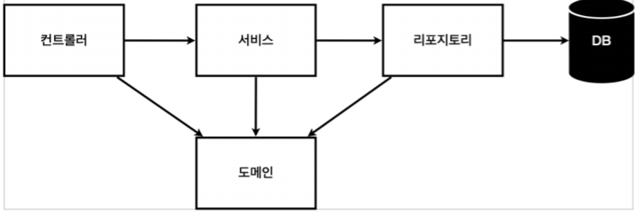

<ol>
    빌드
    <ul>
    - cmd 콘솔창에 ./gradlew build 실행시 빌드
    - cd build/libs
    - 그 안에 ~~~SNAPSHOT.jar 생성
    - java SNAPSHOT.jar 실행 배포완료
    </ul>
</ol>
<ol>
    빌드파일 삭제
    <ul>
    - ./gradlew clean 
    - ./gradlew clean build
    </ul>
</ol>
<ol>
    정적 컨텐츠
    <ul>
    - resources/static 안에 html 파일생성시
    - ex) resources/static/hello-static.html 생성 -> localhost:8080/hello-static.html
    </ul>
</ol>
<ol>
    MVC
    <ul>
    Model, View, Controller
    </ul>
    <ul>
    @ResponseBody
    : HTTP의 Body에 문자 내용을 직접 반환
    : 'viewResolver' 대신 'HttpMessageConverter'가 동작
    : 기본 문자처리 : 'StringHttpMessageConverter'
    : 기본 객체처리 : 'MappingJackson2HttpMessageConverter'
    : byte 처리 등등 기타 여러 HttpMessageConverter가 기본으로 등록되어 있음
    : Controller의 method에서 java object 리턴시 기본적으로 JSON형태
    </ul>
</ol>

기본 비즈니스 로직

<ol>
    <ul>
        Test 코드 작성시
        @AfterEach를 이용해 method 실행 완료시마다 memory를 비워줘야함
        test.hello.hellospring.repository.MemoryMemberRepository.afterEach method 참고
    </ul>
</ol>

<ol>
    @Transactional
    <ul>
    - 테스트 케이스에 이 어노테이션이 있으면,
    테스트 시작 전에 트랜잭션을 시작하고,
    테스트 완료 후에 항상 롤백함.
    이렇게 하면 DB에 데이터가 남지 않으므로 다음 테스트에 영향을 주지 않음
    - 반대로, 항상 Commit을 하게하는 @Commit 어노테이션도 있음
    - 테스트 작업시 DB와 관련된 테스트일시
    DB에 실제 데이터를 Commit 하지 않음
    - 테스트한 이후 데이터를 Commit하지 않고, Rollback 함 
    </ul>
</ol>
<ol>
    AOP가 필요한 상황
    <ul>
    문제
    - 회원가입, 회원 조회에 시간을 측정하는 기능은 핵심 관심사항이 아님
    - 시간을 측정하는 로직은 공통 관심 사항
    - 시간을 측정하는 로직을 별도의 공통 로직으로 만들기 매우 어려움
    - 시간을 측정하는 로직을 변경할 때 모든 로직을 찾아가면서 변경해야 함
    </ul>
    <ul>
    - 공통관심사항(cross-cutting concern) vs 핵심관심사항(core concern)
    </ul>
</ol>
ifPresent methods
Optional class
test에서 class object DI